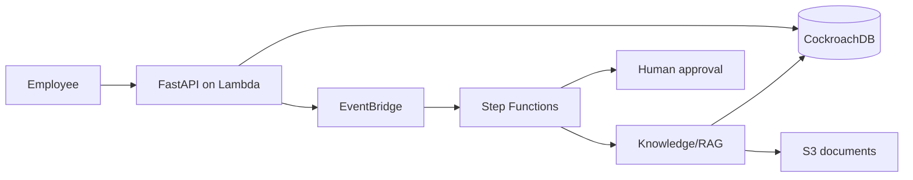

# AI Travel Operations Platform

[](../../actions/workflows/ci.yml)
[](terraform/)
[](pyproject.toml)
[](LICENSE)

An interactive, human-governed travel-operations platform. It demonstrates a customer itinerary
draft journey, centralized specialist orchestration, CockroachDB durable agent provenance,
event-driven human approval, RAG foundations, security controls, evaluation, and
production-oriented infrastructure.

> AI recommends. Humans approve. Every material recommendation is intended to be explainable and source-grounded.

## Why this project

- Clear domain boundaries: API, workflow, knowledge, policy/risk/insurance, and approval
- Production practices: Terraform, least privilege, KMS/Secrets, audit logs, CI/CD
- Explainable AI foundations: citations, prompt versions, grounding checks, evaluations
- Interactive itinerary draft: one request delegates profile, policy, risk, inventory, itinerary,
  and financial specialists; every result is durable, reviewable, and non-booking
- Practical interview discussion: trade-offs, ADRs, diagrams, runbooks, and tests

## Architecture



See [architecture docs](docs/architecture/overview.md), [workflow diagram](docs/diagrams/travel-workflow.mmd), and [event flow](docs/architecture/event-flow.md).

## Quick start

```bash
poetry install --with dev
poetry run pre-commit install
poetry run pytest
```

Configure `JWT_SECRET` and `DATABASE_URL`; then run `poetry run alembic upgrade head`.

The dev deployment exposes the same OpenAPI document through API Gateway. Its implemented
vertical slice is: create request → EventBridge → Step Functions callback wait → authenticated
approval → completion. AI decisioning is deliberately not on this path.

Run the reproducible deployed demonstration with `scripts/run_dev_workflow_demo.py`; see
[Demo data](docs/demo-data.md) for the command.

## Guides

- [Installation](docs/guides/installation.md)
- [Deployment](docs/guides/deployment.md)
- [Developer guide](docs/guides/development.md)
- [Troubleshooting](docs/guides/troubleshooting.md)
- [Demo data](docs/demo-data.md)
- [Operational evidence and SLOs](docs/operations.md)
- [Recovery and DR runbooks](docs/runbooks/README.md)

## Project structure

`src/` application code · `terraform/` reusable IaC · `docs/` architecture and operations · `prompts/` versioned prompts · `evaluations/` golden datasets · `tests/` quality checks.

## Contributing

Use Conventional Commits, run formatting/tests before opening a PR, and record consequential architecture choices as ADRs.
