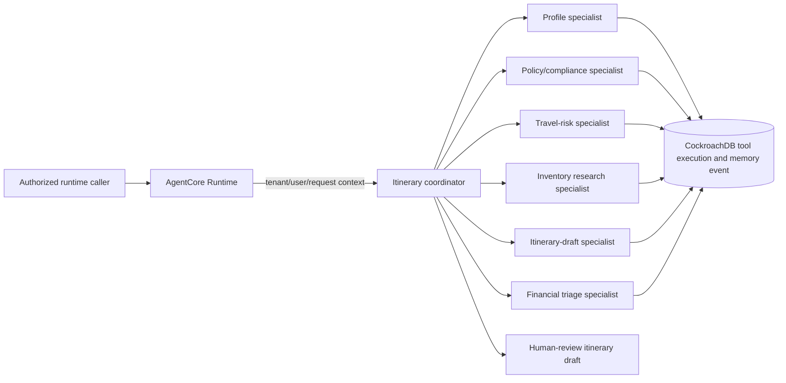

# AgentCore Runtime and travel-policy tool

The development environment uses Amazon Bedrock AgentCore Runtime instead of Amazon Bedrock
Agents. AWS rejected creation of new Bedrock Agents for this account during the service maintenance
mode, so the unavailable control-plane resource is not part of this stack.

The Runtime direct-code package accepts only a complete tenant, user, and travel-request context.
Its centralized `travel_itinerary_coordinator` delegates a fixed, reviewable plan to the
`profile_agent`, `policy_compliance_agent`, `travel_risk_agent`, `inventory_research_agent`,
`itinerary_agent`, and `sales_orchestrator`. The specialist operations read only the durable
request context, create idempotent CockroachDB tool-execution and memory-event provenance, and
never receive arbitrary prompt content.

The current policy and risk specialists intentionally return `REQUIRES_HUMAN_*_REVIEW` until an
authorized model-backed policy and duty-of-care integration is exposed. The itinerary specialist
returns a `DRAFT` with `NOT_BOOKED`; it cannot make a booking or override human approval.

The Runtime role has only permission to read its encrypted versioned ZIP package, decrypt with the
deployment KMS key, and invoke the dedicated tool Lambda. The Lambda resource policy allows only
the named AgentCore Runtime to invoke it. Runtime invocation authorization remains IAM-based; a
user-facing AgentCore endpoint is intentionally not exposed until its authentication contract is
designed.
