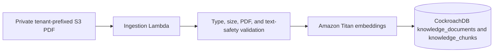
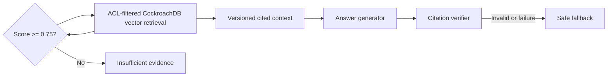

# Retrieval-Augmented Generation

## Secure ingestion foundation

IMP-013 accepts controlled PDF sources only from the private knowledge bucket. Source object keys
must use the `tenant_id/path/file.pdf` namespace. The S3 event invokes the ingestion Lambda, which
checks declared PDF content type, bounded size, PDF signature, encryption state, extractable text,
prompt-injection markers, and the 1024-dimension Titan embedding response before committing data.
The source hash is an immutable version; repeating the same tenant/key/hash returns the existing
document without creating duplicate chunks.

`knowledge_documents` records tenant, source key, version, content type, and page count.
`knowledge_chunks` carries tenant and page metadata alongside the versioned vector.

## Citation retrieval and ACLs

IMP-014 adds `knowledge_document_access`: a document with no role rows is tenant-visible, while a
document with role rows is visible only when the caller supplies a matching role. The CockroachDB
query applies both tenant and role conditions before vector ranking. A retrieved citation includes
the immutable `document_id:chunk_id:version` tuple and page URI. The grounded-answer service rejects
answers without a citation or with a citation absent from the retrieved context.

## Confidence and safe fallback

IMP-016 adds a deterministic confidence gate before generation. The highest tenant- and
role-authorized retrieval score must be at least `0.75`; otherwise the service returns
`INSUFFICIENT_EVIDENCE` and no citations. A generation failure or an answer with missing or
fabricated citations returns `SAFE_FALLBACK` and no citations. Prompt-injection input remains
rejected before retrieval. These outcomes are exposed as `GroundedAnswer` metadata so a future
caller can persist decision provenance without treating a fallback as a recommendation.

Terraform provisions a baseline Bedrock Guardrail with safe input/output messages and a high
strength input `PROMPT_ATTACK` content-filter policy. Bedrock requires the corresponding response
filter strength to be `NONE`. No current runtime invokes a text-generation model, so the Guardrail
is intentionally not represented as enforced model-invocation coverage until a model-backed answer
endpoint is introduced.

## Prompt release governance

IMP-017 treats prompts as reviewed source artifacts. `prompts/releases.json` selects exactly one
active version and records its owner, model assumption, evaluation dataset, minimum release gates,
and rollback version. The active grounded-answer prompt is `v2`; it has an explicit rollback to
`v1`. The registry validates both template and dataset paths at load time.

